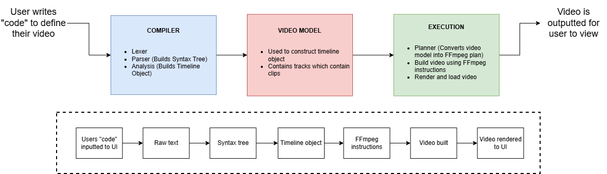

<h1>Program Architecture</h1>

<h3>Dependencies</h3>
<ul>
    <li>Python</li>
    <li>FFmpeg</li>
    <li>Tkinter</li>
    <li>Nsound (or other open-source audio library TBD)</li>
</ul>

<h3>File Structure</h3>

```
dvel/
    - compiler/
        - lexer.py
        - parser.py
        - syntax_tree.py
        - analysis.py
    - video-model/
        - timeline.py
        - track.py
        - clip.py
    - execution/
        - planner.py
        - builder.py
        - render.py
    - ui/
        - window.py
        - controller.py
    - main.py
    - gitignore
    - README.md
```

<h3>Component Description</h3>

<h4>Compiler</h4>
<ul>
    <li><b>Lexer:</b> Raw text -> tokens. Token examples include keywords, identifiers, new lines, time definitions, etc.</li>
    <li><b>Parser:</b> Takes tokens and builds structure, outputs a syntax tree.</li>
    <li><b>Syntax Tree:</b> Tree representation of the user's code.</li>
    <li><b>Analysis:</b> Checks that user's code is valid (validate if files exist, ensure valid time ranges, look for errors, etc.). Builds the timeline object.</li>
</ul>

<h4>Video Model</h4>
<ul>
    <li><b>Timeline:</b> Manages the entire video (collection of video and audio tracks). Contains a list of tracks and total duration.</li>
    <li><b>Track:</b> Individual audio and video tracks. Ordered list of clips.</li>
    <li><b>Clip:</b> Individual elements (clips) of audio and video within each track. Contains source file, start/end times, position on timeline, effects.</li>
</ul>

<h4>Execution</h4>
<ul>
    <li><b>Planner:</b> Converts video model into FFmpeg "plan". This will include what clips need to be trimmed, what order to concetenate clips, what overlays to apply, etc.</li>
    <li><b>Builder:</b> Build video using FFmpeg instructions.</li>
    <li><b>Render:</b> Runs FFmpeg instructions and loads the video.</li>
</ul>

<h4>UI</h4>
<ul>
    <li><b>Window:</b> Create and manage UI components.</li>
    <li><b>Controller:</b> Connect UI to the rest of the system.</li>
</ul>

<h4>Main</h4>
<ul>
    <li>Runs the entire system</li>
</ul>

<h3>Diagram</h3>
