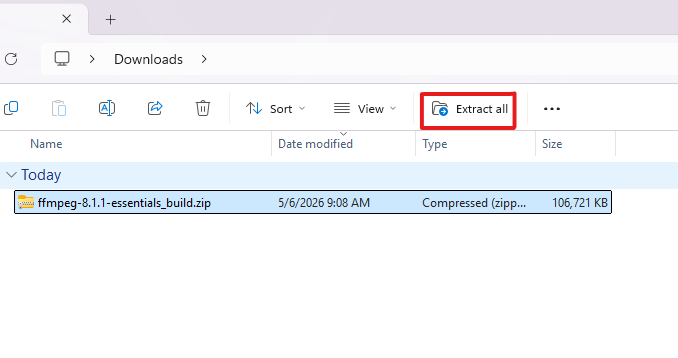
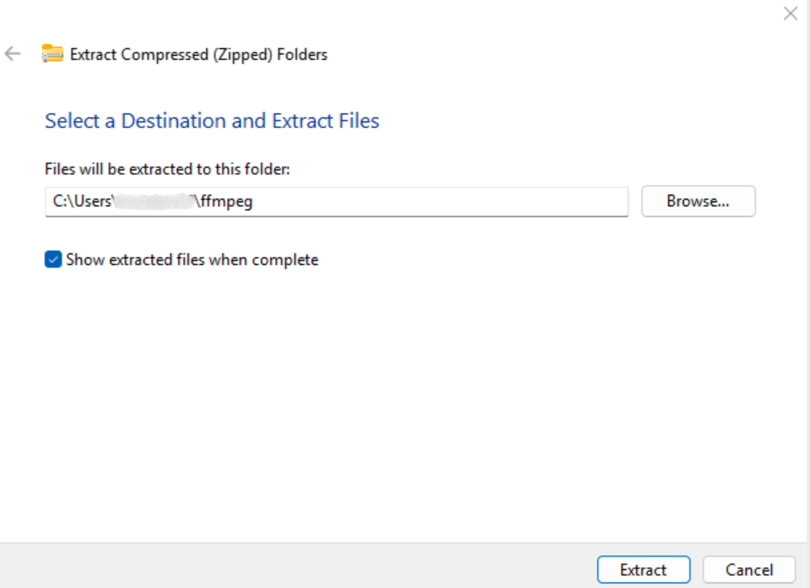
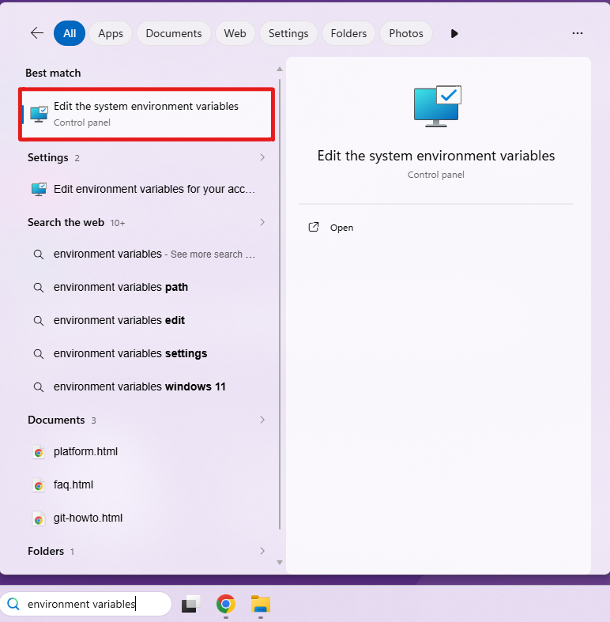
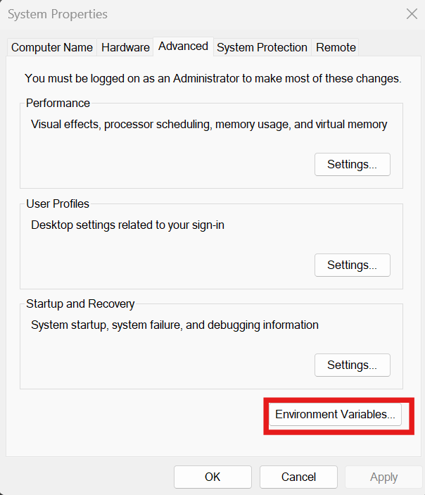
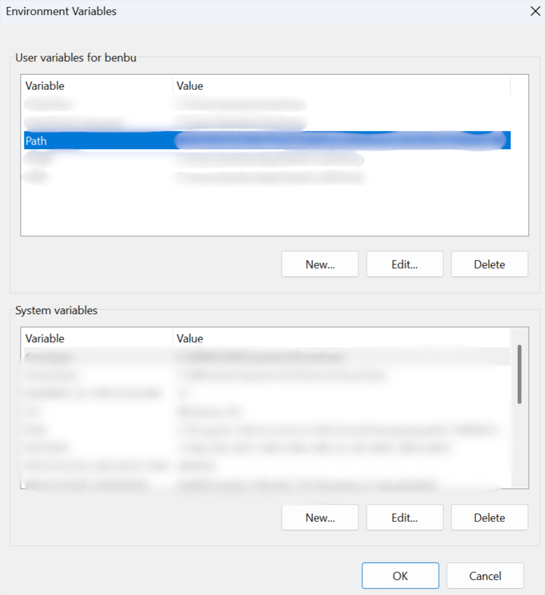
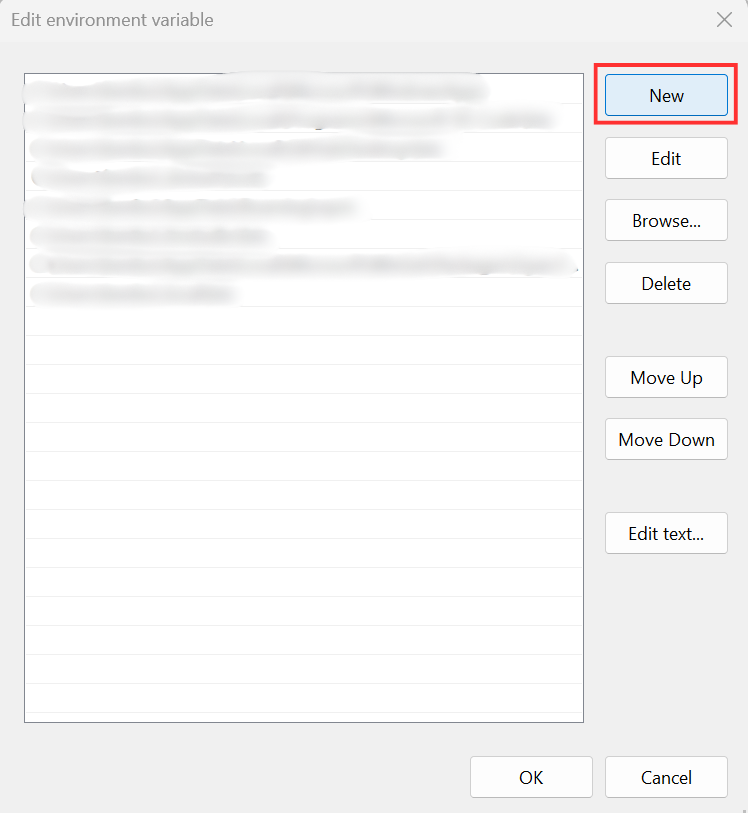

<h1>Installation & Setup</h1>

<h2>Required Dependencies</h2>
<ul>
    <li>Ffmpeg</li>
    <li>VLC Media Player</li>
    <li>Tkinter</li>
</ul>

<h2>Steps to Install Required Dependencies</h2>
<h3>1. FFmpeg</h3>
<p>Go to <a href="https://www.gyan.dev/ffmpeg/builds/">https://www.gyan.dev/ffmpeg/builds/</a> and download the following .zip:</p>

```
ffmpeg-8.0.1-essentials_build.zip
```
<p>Extract the .zip file and remember the location:</p>


<br><br>
<p>Next, open your system environment variables:</p>


<br><br>
<p>Double click on the "path" variable:</p>

<br><br>
<p>Create a new PATH variable, enter the path to the /bin folder inside of the .zip you installed earlier.</p>

<br><br>
<p>Click "OK"</p>
<p>Open the command line and enter the following command:</p>

```
pip install ffmpeg-python
```

<h3>2. VLC Media Player</h3>
<p>Go to <a href="https://apps.microsoft.com/detail/XPDM1ZW6815MQM?hl=en-US&gl=US&ocid=pdpshare">VLC (Microsoft Store)</a> and click "Download".</p>
<p>Once it is downloaded, open the command line and run the following command:</p>

```
pip install python-vlc
```

<h3>3. Tkinter</h3>
<p>Simply run the following command in the command line:</p>

```
pip install tkinter
```
<p>Now all dependencies are installed and you are ready to use DVEL!</p>

<h2>Running The Application</h2>
<p>To run DVEL, simply clone the repository and install all dependencies listed above. Then run the following command from the repository root:</p>

```
python -m src.main
```

<h3>Next: <a href="ImportingMedia.md">Importing Media</a></h3>